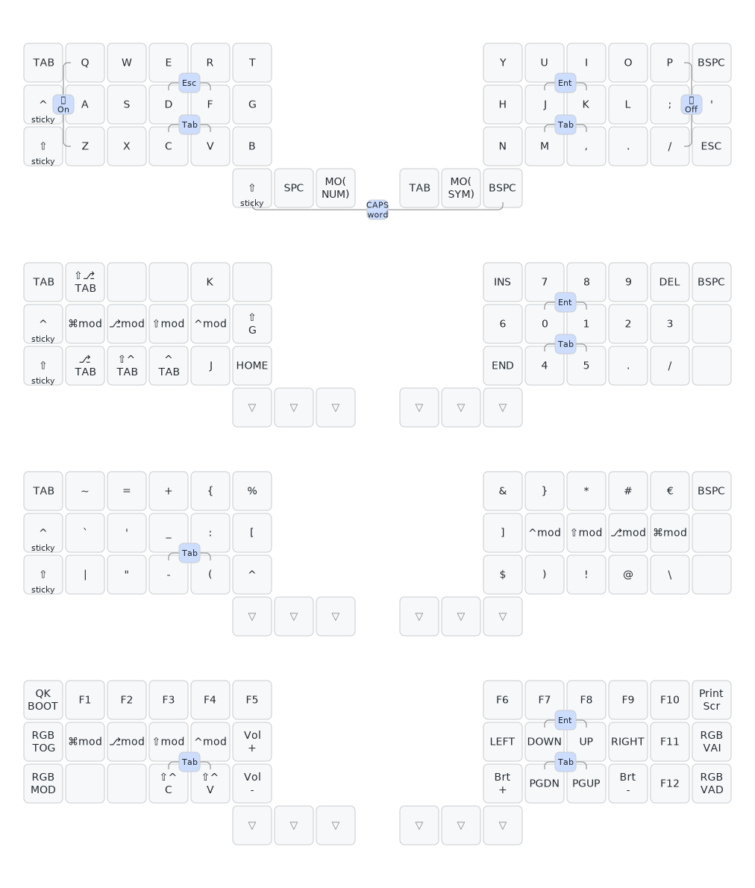

# My QMK keyboard keymaps

This repository contains keymaps for my open-source wired [keyboards](./keyboards).




## Why such a small and weird keyboard?

Because I want to type comfortably.

### Just do touch-typing then?

[Touch-typing maps](https://duckduckgo.com/?q=touch-typing&t=brave&ia=images&iax=images) on a regular keyboard are nice for the letters a-z, but not so much for symbols, modifiers (`Shift`, `Ctrl`, `Alt`, `Cmd/Win/Super`) and special keys like `ESC` and `Backspace`. Those cover large areas of a normal keyboard, and all of that work is supposed to be done by the pinky fingers.

As a programmer, I like using great tools to help me code. An IDE with good autocomplete means I don't normally type out full words when coding. What I do type a lot, is symbols: `(\`{}:['a-b', "a_b/c"])`

I am very grateful for [neovim](https://neovim.io/) (and the [lazyvim](https://www.lazyvim.org/) distribution of it), [lazygit](https://github.com/jesseduffield/lazygit), [k9s](https://k9scli.io/), [wezterm](https://wezterm.org/) and [kitty](https://sw.kovidgoyal.net/kitty/). They enable me to use a pc almost completely with keyboard shortcuts.

So my goal with this was to make it more comfortable to type symbols and modifiers, using all my fingers.

###  Layers and thumb keys

Wouldn't it be nice if we could put all the symbols, modifiers and numbers right in that comfortable area where the letters are?

But you'd need to press some other key at the same time to separate them from the letters. Where do we put this key?

If you've ever looked at a game controller, handheld console, or smartphone, you've seen that almost all the keys are manipulated with the thumbs.

The thumbs can do much more than just hit the space bar. If you put keys close to them.

Those thumb keys can then be used to enable "layers" with numbers, symbols, etc.

This takes some getting used to, but if you use a layer key on each thumb, you get 4 layers. This is more than enough space to put all the keys you want. And that is how you can type everything you want while barely moving your fingers!

## More detailed considerations

I did not want to use home-row mods, or other timing-sensitive tricks, such as Mod-Tap. I want to be able to type as slow as I want to, or as fast as I can. This is why I went with one-shot modifiers on layers, like the [Callum](https://keymapdb.com/keymaps/callum_oakley/) and [Seniply](https://keymapdb.com/keymaps/stevep99/) layouts have popularized.

I have briefly considered placing the letters more optimally, in [Colemak-DH](https://dreymar.colemak.org/) layout, but have opted not to do that for now. [Although QWERTY is a little awkward when typing English words](https://duckduckgo.com/?q=colemak+qwerty+heatmap&iar=images&t=brave), changing to Colemak would also move the Vim keys, or make me unable to use a default vim config. Besides, learning a new alpha layout is much more difficult than just the symbols and modifiers, even if only?for typing words. Perhaps later.

------
# QMK Userspace template

This is forked from a template repository which allows for an external set of QMK keymaps to be defined and compiled. This is useful for users who want to maintain their own keymaps without having to fork the main QMK repository.

## Howto configure your build targets

1. Run the normal `qmk setup` procedure if you haven't already done so -- see [QMK Docs](https://docs.qmk.fm/#/newbs) for details.
1. Fork this repository
1. Clone your fork to your local machine
1. Enable userspace in QMK config using `qmk config user.overlay_dir="$(realpath qmk_userspace)"`
1. Add a new keymap for your board using `qmk new-keymap`
    * This will create a new keymap in the `keyboards` directory, in the same location that would normally be used in the main QMK repository. For example, if you wanted to add a keymap for the Planck, it will be created in `keyboards/planck/keymaps/<your keymap name>`
    * You can also create a new keymap using `qmk new-keymap -kb <your_keyboard> -km <your_keymap>`
    * Alternatively, add your keymap manually by placing it in the location specified above.
    * `layouts/<layout name>/<your keymap name>/keymap.*` is also supported if you prefer the layout system
1. Add your keymap(s) to the build by running `qmk userspace-add -kb <your_keyboard> -km <your_keymap>`
    * This will automatically update your `qmk.json` file
    * Corresponding `qmk userspace-remove -kb <your_keyboard> -km <your_keymap>` will delete it
    * Listing the build targets can be done with `qmk userspace-list`
1. Commit your changes

## Howto build with GitHub

1. In the GitHub Actions tab, enable workflows
1. Push your changes above to your forked GitHub repository
1. Look at the GitHub Actions for a new actions run
1. Wait for the actions run to complete
1. Inspect the Releases tab on your repository for the latest firmware build

## Howto build locally

1. Run the normal `qmk setup` procedure if you haven't already done so -- see [QMK Docs](https://docs.qmk.fm/#/newbs) for details.
1. Fork this repository
1. Clone your fork to your local machine
1. `cd` into this repository's clone directory
1. Set global userspace path: `qmk config user.overlay_dir="$(realpath .)"` -- you MUST be located in the cloned userspace location for this to work correctly
    * This will be automatically detected if you've `cd`ed into your userspace repository, but the above makes your userspace available regardless of your shell location.
1. Compile normally: `qmk compile -kb your_keyboard -km your_keymap` or `make your_keyboard:your_keymap`

Alternatively, if you configured your build targets above, you can use `qmk userspace-compile` to build all of your userspace targets at once.

## Extra info

If you wish to point GitHub actions to a different repository, a different branch, or even a different keymap name, you can modify `.github/workflows/build_binaries.yml` to suit your needs.

To override the `build` job, you can change the following parameters to use a different QMK repository or branch:
```
    with:
      qmk_repo: qmk/qmk_firmware
      qmk_ref: master
```

If you wish to manually manage `qmk_firmware` using git within the userspace repository, you can add `qmk_firmware` as a submodule in the userspace directory instead. GitHub Actions will automatically use the submodule at the pinned revision if it exists, otherwise it will use the default latest revision of `qmk_firmware` from the main repository.

This can also be used to control which fork is used, though only upstream `qmk_firmware` will have support for external userspace until other manufacturers update their forks.

1. (First time only) `git submodule add https://github.com/qmk/qmk_firmware.git`
1. (To update) `git submodule update --init --recursive`
1. Commit your changes to your userspace repository
